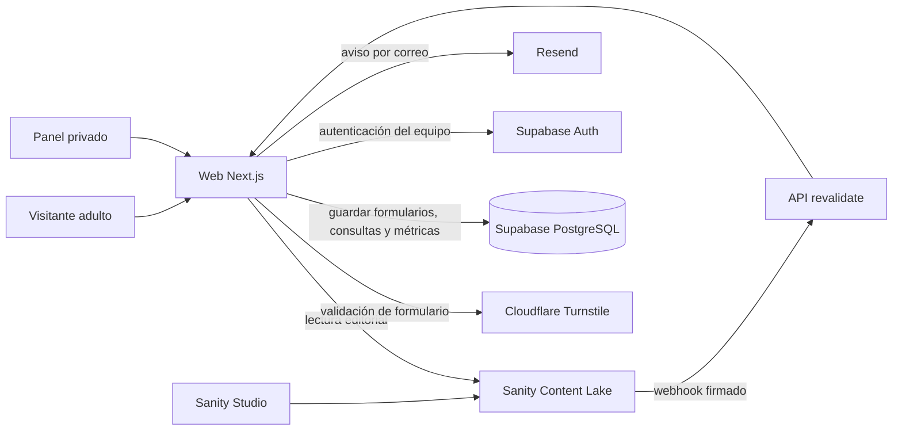

# Referencia funcional y técnica del backend

**Proyecto:** Las Aventuras de Curileta
**Actualizado:** 10 de octubre de 2026
**Alcance:** arquitectura, funciones, almacenamiento, seguridad, configuración y operación del backend que existe en el repositorio.

> Esta es la referencia viva del backend. Distingue el código local, el estado remoto comprobado y lo que aún falta publicar. No se guardan valores de secretos en este documento. La web desplegada no incorpora automáticamente los cambios que siguen pendientes en el repositorio.

## 1. Resumen ejecutivo

La plataforma tiene dos aplicaciones principales: la web pública en Next.js y el CMS editorial Sanity Studio. Supabase proporciona autenticación para el equipo, la base de datos de formularios y consultas, el seguimiento de leads y los contadores estadísticos agregados. Sanity proporciona contenido editorial. Resend envía avisos de los formularios y Cloudflare Turnstile ayuda a filtrar automatizaciones.

El backend ya está implementado en el código para:

- iniciar sesión en el panel mediante Supabase Auth y perfiles con roles;
- obtener y editar formularios de contacto desde Supabase;
- validar, guardar y administrar mensajes enviados por visitantes;
- enviar notificaciones por correo y dejar el envío guardado si falla el correo;
- convertir manualmente mensajes en oportunidades y registrar su fase y notas;
- eliminar consultas cerradas sin seguimiento de lead a los 30 días;
- revisar leads tras 12 meses sin actividad, avisar al equipo sin incluir datos personales y eliminarlos 30 días después del aviso si no se reanuda el seguimiento;
- agregar estadísticas por fecha, ruta, idioma y evento, sin crear perfiles de visitantes;
- compartir o recomendar libros, personajes, canciones, vídeos, eventos, lugares y fondos por el menú del dispositivo, WhatsApp, Telegram, Facebook, LinkedIn, X, correo, SMS o copiando el enlace;
- contar inicios de acciones de compartir por canal y contenido, y votos agregados en vídeos;
- leer contenido editorial de Sanity, invalidar su caché con un webhook firmado y exponer datos mediante rutas de contenido.

El código incorpora módulos administrativos para favoritos de personajes, composición de la tripulación de portada, identidad del canal, catálogo de libros y encuadres. Los favoritos se recuerdan por navegador y se sincronizan con el servidor; los votos de vídeo usan un marcador local y Turnstile. El editor de encuadres cubre cuatro ubicaciones. El 10 de octubre de 2026 se aplicaron manualmente en Production las migraciones 7–9 para favoritos, tripulación, YouTube y libros próximos. Verifiqué sus cinco tablas nuevas, RLS activo, acceso de lectura denegado a `anon` y `authenticated` y acceso de servidor a `service_role`. El código web más reciente está publicado en Vercel Production desde `5a521e1`; el endpoint `/api/character-favorites?locale=es` respondió HTTP 200 con 19 personajes. El historial de migraciones no está reconciliado, por lo que `supabase db push` sigue bloqueado.

El 10 de octubre de 2026 se comprobó el estado remoto: Supabase está saludable, contiene las cuatro tablas originales y un perfil `owner`; sus cinco migraciones originales se aplicaron manualmente, las cinco columnas nuevas de privacidad/retención existen y el job `contact-submission-retention` está activo a las 03:00 UTC. `image_frame_settings` y las tablas de favoritos, tripulación, canal y catálogo existen en Production. Confirmé RLS y permisos restringidos al servidor para las cinco tablas de las migraciones 7–9. Sanity tiene 114 documentos y el webhook de revalidación está habilitado, pero no tiene Studio público desplegado. Vercel Production contiene variables de Supabase, Sanity, Turnstile y revalidación; faltan `RESEND_API_KEY`, `CONTACT_FROM_EMAIL`, `CONTACT_TO_EMAIL`, `PRIVACY_NOTICE_VERSION`, `CRON_SECRET` y la URL pública de Studio. Cloudflare tiene un widget para el dominio de producción. El detalle y sus límites figuran en la sección 13.

## 2. Arquitectura y responsabilidades

| Componente | Responsabilidad | Código y configuración |
|---|---|---|
| Web pública y API | Páginas, formularios, panel y rutas HTTP | `apps/web`, Next.js App Router |
| CMS editorial | Edición de documentos, imágenes, traducciones y ajustes | `apps/studio`, Sanity Studio |
| Contratos de contenido | Tipos y proveedor de contenido local | `packages/cms` |
| Base de datos y autenticación | Perfiles internos, formularios, consultas, analítica y sesiones | Supabase PostgreSQL y Supabase Auth |
| Correo transaccional | Avisos de nuevos envíos | Resend, llamado por `/api/contact` |
| Protección del formulario | Verificación antispam en servidor | Cloudflare Turnstile |
| Publicación web | Variables y despliegue del sitio | Vercel; cambios de favoritos, canal y catálogo publicados en Production; último cambio de código `5a521e1` |



## 3. Contenido editorial dinámico

### 3.1 Selección del proveedor

`apps/web/src/lib/cms/index.ts` selecciona `SanityCMSProvider` si `SANITY_STUDIO_PROJECT_ID` existe y no es el valor de demostración `curileta-demo`. Si no se configura un proyecto real, usa `DatabaseCMSProvider`, el contenido local de respaldo. El Studio, en cambio, se niega a iniciar si falta el identificador real del proyecto.

El proveedor Sanity consulta documentos publicados de tipo `contentEntry` y el documento `siteSettings`. Las consultas se almacenan en caché durante cinco minutos con `unstable_cache`; el webhook firmado invalida etiquetas de contenido y revalida la página raíz.

**Comportamiento que conviene conocer:** si una consulta a Sanity falla, el proveedor registra el error y vuelve a los datos locales. Si Sanity responde correctamente con una lista vacía, devuelve esa lista vacía; en ese caso no usa el contenido local como sustituto. Esto evita ocultar un dataset vacío, pero puede dejar una sección sin contenido hasta que se publiquen documentos.

### 3.2 Tipos de contenido disponibles

El esquema unificado `apps/studio/schemas/documents/contentEntry.ts` permite crear:

1. Personajes (`character`)
2. Libros (`book`)
3. Aventuras (`adventure`)
4. Vídeos (`video`)
5. Canciones (`song`)
6. Lugares (`location`)
7. Puntos de ruta (`trailWaypoint`)
8. Hitos narrativos (`narrativeMilestone`)
9. Curiosidades (`mentionedCuriosity`)
10. Fondos de pantalla (`wallpaper`)
11. Eventos estacionales (`seasonalEvent`)
12. Cartas (`letter`)
13. Próximo contenido (`universeRoadmapItem`)
14. Oportunidades de colaboración (`collaboration`)

`siteSettings` contiene ajustes del sitio, incluidos datos que controlan si las secciones de portada se muestran y en qué orden. Los objetos `localizedString` y `localizedText` guardan traducciones en español e inglés. El español es obligatorio y actúa como idioma de respaldo en varios campos.

`siteSettings` también define título, descripción, URL, etiquetas, avatar y cabecera del canal de YouTube. La web muestra esos datos en la sección de vídeos y actualiza el enlace de suscripción del pie de página. Sanity almacena las imágenes; el proveedor CMS resuelve sus direcciones públicas. `/admin/youtube` permite editar estos campos en español e inglés desde el panel, con almacenamiento protegido en Supabase y prioridad sobre el valor del CMS. La migración y el código se verificaron en Production; el avatar concreto debe seleccionarse desde el panel si aún no se ha configurado.

Cada vídeo puede guardar tipo (episodio, Short, canción o tráiler), fecha, miniatura, duración, número de episodio, descripción, etiqueta destacada, etiquetas y nombre e identificador de lista de YouTube. También admite activar una pregunta y votación para ese vídeo. El equipo crea y actualiza las fichas manualmente; no hay sincronización automática desde YouTube.

### 3.3 Qué partes de la web son dinámicas hoy

La portada y páginas de libros, personajes, canciones, colaboraciones, Curileta, eventos, fondos, mundo, novedades y vídeos consumen el proveedor CMS en el código. El contenido editorial y la visibilidad y orden de secciones de portada pueden venir de Sanity. El formulario, las consultas, los leads y las estadísticas dependen de Supabase.

`/admin/contenidos` resume los módulos editoriales y enlaza al proyecto Sanity. Si `NEXT_PUBLIC_SANITY_STUDIO_URL` apunta a un Studio desplegado, muestra el acceso directo al editor. Mientras falte, avisa de que el enlace al proyecto no edita documentos. El acceso corresponde a `owner`, `admin` y `editor`.

No todo el sitio es editable desde un panel. En esta revisión, las páginas de accesibilidad, cookies, aviso legal, privacidad y prensa contienen textos y metadatos definidos en código. También hay elementos de navegación, interfaz y estructura que son parte de la aplicación, no documentos editables. Por ello, "backend conectado" no significa que cada texto, página, estilo o función se pueda modificar desde el CMS.

Para ampliar la cobertura dinámica hay que diseñar esquemas de edición para los contenidos estáticos que de verdad deban administrar editores y migrar esos textos de forma gradual. Los textos legales requieren que el responsable complete y apruebe la información antes de que el equipo los publique desde el CMS. No conviene convertir estructura o lógica de interfaz en campos CMS sin una necesidad editorial concreta.

### 3.4 Publicación, identificadores y webhook

- La web lee documentos publicados; los documentos de borrador se excluyen de las consultas públicas.
- El dataset `production` debe ser legible por la web si no se proporciona `SANITY_READ_TOKEN`. Para el contenido público del sitio, la guía de instalación recomienda un dataset público.
- Los identificadores públicos importados no deben contener puntos, según la configuración y guía de importación del proyecto.
- El webhook llama `POST /api/revalidate` con la cabecera de firma de Sanity y `SANITY_REVALIDATE_SECRET`. El endpoint limita el cuerpo a 32 KB, valida la firma y solo acepta `contentEntry` con `contentType` o `siteSettings`.
- La caché normal tiene una ventana de hasta cinco minutos. Un webhook válido busca reducir esa demora al publicar.
- `SANITY_WRITE_TOKEN` solo se utiliza temporalmente en importaciones locales. No se debe desplegar. `SANITY_READ_TOKEN` se necesita solo si el dataset requiere autenticación.

### 3.5 Importación del contenido existente

Los scripts del monorepo son:

```sh
npm run sanity:import:dry-run
npm run sanity:import
npm run sanity:migrate-public-ids:dry-run
npm run sanity:migrate-public-ids
```

El orden y las condiciones previas están en [BACKEND_SETUP.md](./BACKEND_SETUP.md). Ejecuta primero el modo de simulación, revisa los recuentos y confirma que el proyecto y dataset seleccionados son los esperados. Después de importar, revoca y elimina el token temporal de escritura.

## 4. Formularios de contacto configurables

### 4.1 Configuración

La tabla `contact_forms` almacena título y descripción localizados, activación, definición de campos y preferencias de notificación. El formulario público solicita `GET /api/forms/{slug}?locale=es|en` y la web usa esa respuesta para construir los campos.

Los tipos de campo aceptados por el panel son `text`, `email`, `textarea`, `select` y `checkbox`. Cada campo puede tener clave, etiqueta localizada, obligatoriedad, longitud máxima, opciones para listas y una función de sistema. El servidor exige que cada formulario mantenga exactamente un campo de sistema `name`, uno `email` y uno `message`. Las opciones de listas tienen valores únicos y límites de cantidad y longitud.

La interfaz administrativa vive en `/admin/forms`. Solo `owner` y `admin` pueden consultarla o editarla. Desde ahí se modifican textos, campos, estado activo y configuración de destinatarios por defecto o por categoría. La notificación finalmente usa `CONTACT_TO_EMAIL` como destino de reserva.

### 4.2 Envío y validación

`POST /api/contact` aplica este flujo:

1. Limita el cuerpo a 24 KB y exige JSON válido.
2. Responde con éxito genérico a un honeypot rellenado, sin guardar el envío.
3. En producción falla de forma cerrada con HTTP 503 si falta Turnstile del servidor, la site key pública o `PRIVACY_NOTICE_VERSION`.
4. Si Turnstile tiene secreto configurado, valida el token mediante el endpoint `siteverify` de Cloudflare con un límite de espera de cinco segundos.
5. Comprueba el `formSlug`, idioma, campos, formato de correo, opciones permitidas, obligatoriedad y longitud.
6. Exige nombre, correo y mensaje; si el esquema configura confirmación de persona adulta o de privacidad, también exige ambas confirmaciones.
7. Guarda los datos y respuestas en `contact_submissions` antes de solicitar el correo.
8. Registra el evento agregado `contact_submit`.
9. Envía por Resend un aviso genérico con un enlace al panel; no incluye nombre, correo ni contenido del mensaje. Si no hay configuración de correo o el envío falla, conserva la consulta en Supabase, marca el estado de correo como fallido y responde HTTP 202 con `notificationPending: true`.

Los textos del mensaje y las respuestas se escapan antes de incluirse en HTML para el correo. Si el correo llega a enviarse, el panel marca `email_status` como `sent`.

### 4.3 Dependencias operativas

- La migración inicial y el registro `contact` deben existir en Supabase.
- Para producción, Turnstile y `PRIVACY_NOTICE_VERSION` son obligatorios para mostrar y enviar el formulario.
- Para recibir el aviso por correo, hacen falta `RESEND_API_KEY`, `CONTACT_FROM_EMAIL` con dominio validado y `CONTACT_TO_EMAIL` o un destinatario configurado en el formulario.
- La entrega de correo es una notificación, no el almacenamiento principal. La fila de Supabase queda como registro del mensaje incluso si Resend falla.

## 5. Consultas y gestión de leads

### 5.1 Bandeja de consultas

`/admin/consultas` muestra mensajes almacenados en Supabase. Los roles `owner` y `admin` pueden cambiar su estado y eliminar registros. Los estados de consulta son `new`, `in_progress`, `resolved` y `archived`. La tabla también registra `email_status` (`pending`, `sent`, `failed`) y un error técnico de entrega, sin incluirlo en la respuesta al visitante.

### 5.2 Seguimiento de leads

La conversión a lead es manual desde la bandeja, para que el equipo decida qué consultas requieren seguimiento comercial. `/admin/leads` permite buscar, cambiar fase y guardar notas internas de hasta 4.000 caracteres. Las fases son `new`, `contacted`, `qualified`, `won` y `lost`.

Quitar un lead de la lista pone `lead_stage` a `null`; no elimina el mensaje ni las notas. Esto devuelve el registro a la política normal de retención. `owner` y `admin` tienen acceso a la lista y a su actualización.

### 5.3 Conservación automática

La migración `20261010020000_lead_management_and_retention.sql` añade `resolved_at`, `lead_stage` y `lead_notes`. `20261010040000_privacy_and_lead_retention.sql` añade el registro del acuse de privacidad y las marcas de actividad, aviso y eliminación de leads, y actualiza la función diaria de limpieza. `20261010050000_contact_privacy_compatibility.sql` conserva temporalmente la clave de sistema que conoce la versión de la web actualmente publicada.

- Al cerrar una consulta (`resolved` o `archived`), el disparador registra la fecha de cierre. Si se vuelve a abrir, borra `resolved_at`; un cierre posterior inicia un nuevo plazo.
- La limpieza solo borra registros cuyo estado sea cerrado, cuyo `lead_stage` sea nulo y cuya fecha de cierre tenga más de 30 días.
- Las consultas abiertas no entran en esa regla.
- Cada envío inicializa `lead_last_activity_at`. Cambiar estado, fase o notas actualiza esa marca y reinicia cualquier aviso o eliminación programados.
- Un lead sin actividad durante 12 meses queda pendiente de revisión. La función web `/api/cron/lead-retention` envía al equipo un aviso agregado que no incluye datos personales. Tras enviar el aviso correctamente, programa la eliminación para 30 días después.
- Si el correo de aviso no está configurado o falla, el lead permanece guardado y no se programa su eliminación. La ruta exige `CRON_SECRET`; Resend requiere `RESEND_API_KEY`, `CONTACT_FROM_EMAIL` y `CONTACT_TO_EMAIL`.
- Los leads con una fase asignada ya no se conservan indefinidamente por defecto: tras aviso y plazo de gracia se eliminan si no se actualiza su actividad. El equipo puede reabrir o actualizar el seguimiento para reiniciar el plazo.
- Al instalar esta política, se reinicia `resolved_at` para consultas cerradas sin lead que ya existan, tal como se confirmó. La verificación en Production encontró 0 consultas cerradas sin lead, así que no hubo registros existentes cuyo reloj hubiera que reiniciar ni filas eliminadas. Las nuevas consultas cerradas empiezan el plazo al cerrarse.
- `pg_cron` ejecuta `public.purge_expired_contact_submissions()` todos los días a las 03:00 UTC. El webhook de la aplicación está configurado en `apps/web/vercel.json` para 03:30 UTC y necesita estar desplegado junto con `CRON_SECRET` para enviar avisos de leads.
- La limpieza solo afecta a Supabase. No borra avisos ya entregados al buzón de Resend ni copias guardadas allí.

La retención aplicada debe coincidir con el aviso de privacidad y con la política de conservación del buzón receptor.

## 6. Panel, autenticación y permisos

El panel usa Supabase Auth para validar identidad y cookies de sesión. Después busca un perfil en `admin_profiles`; sin perfil válido, el usuario no entra al panel. `getAdminIdentity()` consulta `auth.getUser()` mediante el cliente de sesión y lee el perfil con el cliente de servidor.

| Rol | Resumen | Acceso implementado |
|---|---|---|
| `owner` | Control total del panel | Resumen, formularios, consultas, leads y estadísticas |
| `admin` | Administración operativa | Resumen, formularios, consultas, leads y estadísticas |
| `editor` | Acceso interno limitado | Resumen, contenidos y encuadres visuales; no consulta mensajes personales |
| `analyst` | Análisis | Resumen y estadísticas agregadas; no ve mensajes personales ni formularios |

El panel oculta navegación según el rol y las rutas de API vuelven a exigir autorización en servidor. No se debe confiar solo en que una sección esté oculta en el navegador. `owner` y `admin` son los únicos roles que pueden revisar y eliminar consultas. `analyst` puede ver estadísticas agregadas. El primer usuario necesita un registro en `admin_profiles`; el SQL de ejemplo está en [BACKEND_SETUP.md](./BACKEND_SETUP.md).

### Vistas del panel

- **Resumen:** consultas de los últimos siete días, consultas nuevas, formularios activos y vistas de página de hoy. Solo administración ve las cinco consultas más recientes con datos de contacto.
- **Formularios:** configuración bilingüe y de destinatarios para roles `owner` y `admin`.
- **Consultas:** bandeja con estado de tratamiento y estado de aviso por correo.
- **Oportunidades:** consultas seleccionadas, notas y fase. La URL interna sigue siendo `/admin/leads`; la interfaz se muestra en español.
- **Contenidos:** acceso editorial a Sanity y estado de módulos operativos o pendientes. El editor de documentos requiere publicar Sanity Studio.
- **Encuadres:** `/admin/encuadres` permite previsualizar, arrastrar, posicionar y ampliar imágenes dentro de cuatro marcos registrados. `owner`, `admin` y `editor` pueden guardar. Los valores están limitados a posiciones entre 0 y 100 y ampliación de 1 a 2. Se guardan en Supabase y se aplican en la página de inicio, el catálogo y el detalle del libro mediante `revalidatePath`. Si la tabla no existe, la web pública usa valores por defecto y la API del panel responde 503.
- **Canal de YouTube:** `/admin/youtube` edita el nombre y la descripción del canal en español e inglés, URL, etiquetas, avatar y cabecera. La API `/api/admin/youtube-channel` valida longitudes y enlaces HTTPS, exige `owner`, `admin` o `editor`, y persiste un único documento JSON en `youtube_channel_settings`. Las páginas públicas combinan ese ajuste con los datos existentes del CMS; si la tabla aún no existe, mantienen los valores del CMS. La subida de ficheros no está implementada: el panel recibe URL HTTPS de imágenes.
- **Catálogo de libros:** `/admin/libros` ordena los tres libros que se muestran en portada y permite redactar próximas publicaciones con título localizado, descripción opcional y fecha opcional. La imagen de próxima publicación usa una cubierta genérica sin texto; los rótulos se traducen desde la web. La API `/api/admin/book-catalog` restringe la gestión a `owner`, `admin` y `editor`, valida los datos y guarda ajustes en `book_catalog_settings`. Los libros publicados y su contenido editorial siguen en Sanity.
- **Tripulación de portada:** `/admin/personajes-destacados` permite seleccionar hasta seis personajes asociados al episodio publicado más reciente o, si no hay episodios, al libro publicado más reciente. El CMS determina qué personajes participan mediante las etiquetas del episodio o la relación del libro. La selección se guarda en `home_character_crew_settings`; la portada no inventa participantes cuando faltan relaciones.
- **Favoritos de personajes:** la web mantiene un voto por navegador y personaje, expone el ranking y la posición en las fichas y tarjetas, y agrega altas y bajas por día para `/admin/estadisticas`. La API pública usa un hash derivado de un secreto de servidor y la base no expone filas individuales a `anon` ni `authenticated`.
- **Estadísticas:** recuentos de páginas, formularios, acciones para compartir, canales y votos en rangos de 7 a 90 días para administración y analistas.
- **Libros:** `/admin/libros` gestiona hasta tres destacados de portada y hasta doce próximas publicaciones con título ES/EN, descripción opcional, fecha opcional y cubierta genérica sin texto. La ficha editorial completa de un libro publicado permanece en Sanity.
- **Personajes destacados:** `/admin/personajes-destacados` selecciona entre uno y seis personajes enlazados al episodio publicado más reciente, o al último libro publicado si no hay episodios. Los tags/relaciones de participación se editan en Sanity; la selección de portada se guarda en Supabase.
- **Favoritos:** `/admin/estadisticas` muestra totales agregados y evolución diaria; ranking y medallas se muestran en páginas públicas. Un voto por personaje y UUID de navegador; quitarlo borra la fila actual, no los agregados diarios.

## 7. Estadísticas y minimización de datos

`packages/analytics/src/index.ts` envía un subconjunto permitido de eventos cuando existe `window` y el navegador no activa `Do Not Track`. El cliente no manda propiedades del evento al endpoint; deriva la ruta y el idioma de la URL. Para compartir, envía el canal, tipo y slug del contenido. El servidor valida el cuerpo, idioma, evento y que el slug exista en el CMS publicado; después usa una ruta canónica de la forma `/{idioma}/contenido/{tipo}/{slug}`. Para eventos normales valida las rutas públicas admitidas. Al final llama a `record_public_analytics`.

La base conserva agregados en `analytics_daily`, con clave por fecha, evento, ruta e idioma. No se crea una fila individual por visitante ni una tabla de comparticiones. La función de base de datos admite los eventos de navegación y contenido (`page_view`, `contact_submit`, `book_view`, `book_purchase_click`, `video_play`, `character_view`, `map_destination_open`, `song_play`, `wallpaper_download`), las acciones `content_share_{native,copy,whatsapp,telegram,email,sms,facebook,linkedin,x}` y `video_vote`.

El componente `ShareActions` ofrece compartir del dispositivo, WhatsApp, Telegram, Facebook, LinkedIn, X, correo, SMS y copiar el enlace. Está integrado en vídeos, canciones, libros, personajes, eventos estacionales, lugares y fondos de pantalla. En la hoja nativa registra cuando la API del dispositivo resuelve la acción sin cancelación. En opciones externas registra el clic que inicia la acción; Curileta no recibe confirmación de que la aplicación se haya abierto ni de que la persona haya terminado el envío. La copia se cuenta solo cuando el navegador confirma que copió el enlace. En navegadores sin permisos de portapapeles se muestra una dirección seleccionable para copiar manualmente, sin contabilizar una copia confirmada. El panel separa los canales y el contenido, y no presenta estos datos como envíos externos confirmados.

Los controles aparecen en vídeos, canciones, libros, personajes, eventos estacionales, lugares y fondos de pantalla. En vídeos y canciones el enlace puede dirigir a YouTube; en otras fichas se comparte la URL de la página actual. La hoja nativa puede mostrar otras aplicaciones instaladas en el dispositivo. La analítica respeta `Do Not Track` y no crea identificadores persistentes; esta limitación aplica a analítica, no a favoritos de personajes, que usan un token aleatorio por navegador para sostener el ranking.

El CMS puede activar la votación por vídeo y editar su pregunta. `VideoVote` exige que Turnstile valide el reto antes de registrar `video_vote`. La base conserva solo el contador agregado diario. Después de un voto válido, el endpoint revalida la portada y la página de vídeos para actualizar el total mostrado. `localStorage` marca el voto en ese navegador para evitar repetir por accidente; no es una identidad ni impide que alguien borre el almacenamiento o vote desde otro navegador. Las estadísticas muestran el total y los vídeos con más votos durante el periodo seleccionado.

La analítica agregada no crea identificadores persistentes ni perfiles, y no ofrece sesiones, embudos individuales ni atribución de campañas. La función de favoritos sí usa un UUID aleatorio guardado en `localStorage`; el servidor guarda su SHA-256 para recordar los votos por navegador. Quitar un favorito elimina la fila individual, mientras el contador agregado diario permanece. Las filas de favoritos no tienen vencimiento automático todavía; el responsable debe definir un periodo de retención y aplicarlo en una migración futura.

## 8. Base de datos

Las migraciones versionadas incluyen `supabase/migrations/20261010010000_backend.sql`, `20261010020000_lead_management_and_retention.sql`, `20261010030000_content_share_analytics.sql`, `supabase/migrations/20261010040000_privacy_and_lead_retention.sql`, `supabase/migrations/20261010050000_contact_privacy_compatibility.sql` y `supabase/migrations/20261010060000_image_frame_settings.sql`, además de `20261010070000_character_favorites_and_story_crew.sql`, `20261010080000_youtube_channel_settings.sql` y `20261010090000_book_catalog_settings.sql`. Las nueve se aplicaron manualmente en Supabase Production y se verificaron sus objetos; el historial de migraciones sigue sin reconciliarse y no se debe usar `supabase db push` hasta hacerlo. La tercera amplía los eventos agregados; la cuarta añade marcas de privacidad y retención; la quinta conserva compatibilidad temporal del formulario; la sexta crea el almacenamiento protegido de encuadres visuales; la séptima incorpora favoritos globales y selección de personajes destacados; la octava protege el ajuste administrativo del canal de YouTube; la novena protege el catálogo editorial configurable.

| Tabla | Uso | Campos relevantes |
|---|---|---|
| `admin_profiles` | Asociación de usuario Auth a rol interno | `user_id`, `display_name`, `role`, marcas de tiempo |
| `contact_forms` | Definición de formularios configurables | `slug`, título y descripción JSON por idioma, `enabled`, `fields`, `notification_settings` |
| `contact_submissions` | Mensajes personales recibidos | `form_id`, `form_slug`, idioma, nombre, email, compañía, categoría, mensaje, respuestas JSON, acuse de privacidad, versión de aviso, estado/email y marcas de actividad, aviso y eliminación de leads |
| `analytics_daily` | Contadores diarios agregados | fecha, evento, ruta, idioma y `event_count` |
| `image_frame_settings` | Encuadre de imágenes de la web | `target_key`, `position_x`, `position_y`, `zoom`, `updated_by`, `updated_at` |
| `character_favorites` | Favoritos globales anónimos por personaje | `visitor_hash`, `character_slug`, `created_at`, `updated_at` |
| `character_favorite_daily` | Cambios agregados diarios de favoritos | `day`, `character_slug`, `action`, `event_count` |
| `home_character_crew_settings` | Selección de personajes de la historia más reciente para portada | `chapter_slug`, `character_slugs`, `updated_by`, `updated_at` |
| `youtube_channel_settings` | Configuración localizada del canal y su identidad visual | `setting_key`, `config`, `updated_by`, `updated_at` |
| `book_catalog_settings` | Selección de portada y publicaciones próximas | `setting_key`, `featured_book_slugs`, `upcoming_books`, `updated_by`, `updated_at` |

La migración inicial crea el formulario `contact` bilingüe con campos de nombre, correo, organización, país, categoría, mensaje y confirmaciones de persona adulta y privacidad.

### Row Level Security

Las tablas con datos protegidos usan RLS. Las migraciones revocan permisos directos de `anon` y `authenticated` en formularios, consultas, analítica y ajustes privados, y conceden al cliente `service_role` los permisos de servidor. Un usuario autenticado solo puede leer su propio perfil mediante la política de `admin_profiles`. La función de analítica limita la lista de eventos, valida rutas e idiomas, y su ejecución directa queda revocada para los roles públicos y autenticados. En Production se verificó RLS y la matriz de permisos en `image_frame_settings` y en las cinco tablas creadas por las migraciones 7–9.

La clave secreta de Supabase omite RLS. Por eso el cliente que la utiliza está marcado `server-only` y solo debe vivir en handlers o código de servidor. Cada endpoint administrativo debe autorizar el rol antes de usar ese cliente. `image_frame_settings` no concede acceso a `anon` ni `authenticated`; la lectura pública de la web y las escrituras administrativas pasan por el cliente de servidor. La API valida la clave objetivo frente al registro de marcos admitidos.

## 9. Inventario de API

| Ruta | Método | Función y acceso |
|---|---|---|
| `/api/forms/[slug]` | `GET` | Devuelve configuración activa y pública del formulario; sin datos de consultas; falla en producción si faltan Turnstile o versión de aviso |
| `/api/contact` | `POST` | Valida Turnstile y campos, persiste mensaje, cuenta evento y manda aviso por correo |
| `/api/revalidate` | `POST` | Verifica firma de webhook Sanity e invalida caché de tipos admitidos |
| `/api/admin/auth/login` | `POST` | Valida credenciales de Supabase Auth y que haya perfil administrativo |
| `/api/admin/auth/logout` | `POST` | Cierra sesión de Supabase Auth |
| `/api/admin/overview` | `GET` | Indicadores del panel; datos personales recientes solo para `owner` y `admin` |
| `/api/admin/analytics` | `GET` | Estadísticas para `owner`, `admin` y `analyst`, rango entre 7 y 90 días |
| `/api/admin/analytics` | `POST` | Ingesta pública validada de vistas, compartir y votos; los votos verifican Turnstile y las acciones de contenido validan el slug publicado |
| `/api/admin/forms` | `GET` | Lista formularios para `owner` y `admin` |
| `/api/admin/forms/[id]` | `PATCH` | Valida y actualiza configuración de formulario para `owner` y `admin` |
| `/api/admin/submissions` | `GET` | Lista hasta 100 consultas para `owner` y `admin` |
| `/api/admin/submissions/[id]` | `PATCH` | Cambia estado, fase de lead o notas para `owner` y `admin` |
| `/api/admin/submissions/[id]` | `DELETE` | Elimina un mensaje de Supabase para `owner` y `admin` |
| `/api/admin/leads` | `GET` | Lista hasta 500 leads para `owner` y `admin` |
| `/api/admin/image-frames` | `GET` | Lista encuadres guardados para `owner`, `admin` y `editor` |
| `/api/admin/image-frames` | `PUT` | Valida y guarda posición y ampliación de un marco registrado; invalida inicio y catálogo |
| `/api/admin/character-favorites` | `GET` | Estadísticas agregadas de favoritos para `owner`, `admin` y `analyst` |
| `/api/admin/home-character-crew` | `GET`, `PUT` | Consulta la historia publicada más reciente y guarda participantes elegibles para `owner`, `admin` y `editor` |
| `/api/admin/youtube-channel` | `GET`, `PUT` | Lee y guarda configuración visual y localizada del canal para `owner`, `admin` y `editor` |
| `/api/admin/book-catalog` | `GET`, `PUT` | Lee y guarda orden de portada y libros próximos para `owner`, `admin` y `editor` |
| `/api/character-favorites` | `GET`, `POST` | Lee el ranking y alterna un favorito por personaje; registra agregados en servidor |
| `/api/cron/lead-retention` | `GET` | Protegida con `CRON_SECRET`; envía aviso agregado de revisión y programa 30 días de gracia tras confirmación de Resend |
| `/api/v1/books`, `/api/v1/books/[slug]` | `GET` | Libros y detalle desde el proveedor CMS |
| `/api/v1/characters`, `/api/v1/characters/[slug]` | `GET` | Personajes y detalle desde el proveedor CMS |
| `/api/v1/content/[section]` | `GET` | Secciones agregadas, ajustes, contenido editorial y datos de universo |
| `/api/v1/events/active` | `GET` | Evento estacional activo |
| `/api/v1/letters`, `/api/v1/letters/[id]` | `GET` | Cartas y detalle |
| `/api/v1/locations` | `GET` | Lugares, hitos y puntos de ruta |
| `/api/v1/settings` | `GET` | Ajustes del sitio |
| `/api/v1/wallpapers` | `GET` | Fondos de pantalla |

Las rutas administrativas que consultan datos personales son privadas y responden con `Cache-Control: private, no-store` cuando devuelven datos sensibles.

## 10. Variables de entorno

Los archivos de plantilla son `apps/web/.env.example` y `apps/studio/.env.example`. El archivo local `apps/web/.env.local` está excluido de Git. Los nombres siguientes describen la configuración, nunca se deben copiar valores secretos a documentación o commits.

| Variable | Dónde | Uso |
|---|---|---|
| `NEXT_PUBLIC_SITE_URL` | Web | URL canónica para metadatos y sitemap |
| `SUPABASE_URL` | Servidor web | URL primaria del proyecto Supabase |
| `NEXT_PUBLIC_SUPABASE_URL` | Compatibilidad | Alias antiguo aceptado si falta `SUPABASE_URL` |
| `SUPABASE_PUBLISHABLE_KEY` | Servidor web | Cliente con cookie de sesión para Auth |
| `NEXT_PUBLIC_SUPABASE_PUBLISHABLE_KEY` | Compatibilidad | Alias antiguo aceptado si falta la clave publicable actual |
| `SUPABASE_SECRET_KEY` | Solo servidor | Operaciones administrativas con privilegios elevados |
| `SUPABASE_SERVICE_ROLE_KEY` | Compatibilidad | Clave heredada aceptada como alternativa a la clave secreta |
| `SUPABASE_JWKS_URL` | Configuración | URL JWKS del proyecto, documentada para integración futura; la sesión actual se valida con `auth.getUser()` |
| `SANITY_STUDIO_PROJECT_ID` | Web y Studio | ID del proyecto Sanity real |
| `SANITY_STUDIO_DATASET` | Web y Studio | Dataset, normalmente `production` |
| `NEXT_PUBLIC_SANITY_STUDIO_URL` | Web | Dirección HTTPS del Studio publicado que enlaza `/admin/contenidos` |
| `SANITY_READ_TOKEN` | Solo servidor web, opcional | Lectura si el dataset es privado |
| `SANITY_WRITE_TOKEN` | Solo importación local, temporal | Escritura para importar o migrar documentos; revocar y retirar al terminar |
| `SANITY_REVALIDATE_SECRET` | Web y webhook Sanity | Firma compartida para invalidar caché |
| `RESEND_API_KEY` | Solo servidor web | Autenticación de la API de correo |
| `CONTACT_FROM_EMAIL` | Web | Remitente verificado en Resend |
| `CONTACT_TO_EMAIL` | Web | Destino de reserva del formulario |
| `CRON_SECRET` | Solo servidor web | Autoriza la llamada programada a `/api/cron/lead-retention` |
| `PRIVACY_NOTICE_VERSION` | Web | Versión del aviso aceptado y condición para activar formulario en producción |
| `NEXT_PUBLIC_TURNSTILE_SITE_KEY` | Cliente y servidor web | Identificador público del widget de Cloudflare |
| `TURNSTILE_SECRET_KEY` | Solo servidor web | Verificación del token con Cloudflare |
| `NODE_ENV` | Plataforma | Distingue las condiciones de producción y desarrollo |

`CURILETA_DB_PATH` pertenece al almacenamiento SQLite local de respaldo. No configura la base de datos Supabase.

### Estado local revisado

En `apps/web/.env.local` se comprobó presencia no vacía de `SUPABASE_URL`, `SUPABASE_PUBLISHABLE_KEY`, `SUPABASE_SECRET_KEY`, `SANITY_STUDIO_PROJECT_ID` y `SANITY_STUDIO_DATASET`. En esa inspección estaban vacías o ausentes `PRIVACY_NOTICE_VERSION`, `RESEND_API_KEY`, `CONTACT_FROM_EMAIL`, `CONTACT_TO_EMAIL`, `SANITY_REVALIDATE_SECRET`, `NEXT_PUBLIC_TURNSTILE_SITE_KEY` y `TURNSTILE_SECRET_KEY`.

El 10 de octubre de 2026 también se revisó el estado remoto: Vercel Production contiene las variables de Supabase, Sanity, Turnstile y revalidación; faltan `RESEND_API_KEY`, `CONTACT_FROM_EMAIL`, `CONTACT_TO_EMAIL`, `PRIVACY_NOTICE_VERSION`, `CRON_SECRET` y `NEXT_PUBLIC_SANITY_STUDIO_URL`. El proyecto Sanity `Curileta CMS` usa el dataset `production`, tiene 114 documentos y su webhook de revalidación está activo. Aún no tiene Studio publicado. En Cloudflare existe el widget de producción para `curileta-pink.vercel.app`. Las claves no se imprimen ni se copian aquí.

Supabase responde y tiene las cuatro tablas originales, `image_frame_settings` y un perfil `owner`; también se comprobó activa la tarea de retención diaria a las 03:00 UTC. El ajuste del proyecto muestra región West EU (Irlanda), código `eu-west-1`. Las seis migraciones del repositorio se ejecutaron manualmente en SQL Editor; se verificaron las columnas nuevas, la programación diaria y los permisos de la tabla de encuadres. La comprobación de `image_frame_settings` devolvió RLS activado, lectura denegada a `anon` y `authenticated` y lectura permitida a `service_role`. La consulta de compatibilidad devolvió `privacy_consent_exists = true` y `acknowledgement_exists = false`. La comprobación de consultas cerradas sin lead devolvió 0 registros; no se eliminó ninguna fila durante la migración. El historial de migraciones sigue vacío y no existe la tabla `supabase_migrations.schema_migrations`; las ejecuciones no quedaron reconciliadas. Antes de usar `supabase db push`, hay que reconciliar ese historial para evitar que intente aplicar de nuevo el esquema inicial o las migraciones manuales.

## 11. Avisos legales y activación de formularios

Las páginas localizadas viven en `apps/web/src/app/[locale]/legal/page.tsx` y `privacidad/page.tsx`. El código local incluye la identidad, el domicilio, el correo y el NIF facilitados por el titular. La capa informativa del formulario muestra responsable, finalidad/base jurídica propuesta, proveedores, conservación y derechos. El campo obligatorio “He leído la información de privacidad” registra un acuse (`privacy_notice_acknowledged`), no un consentimiento para marketing. El texto local continúa siendo un borrador; no constituye aprobación legal ni verificación de cumplimiento.

### Decisiones registradas y revisión pendiente

La normativa de servicios de la sociedad de la información incluye la identificación y el NIF entre la información general del prestador; ese dato ya está incorporado al borrador local ([LSSI, artículo 10](https://www.boe.es/buscar/act.php?id=BOE-A-2002-13758)). El RGPD y la guía de información de la AEPD cubren finalidades, bases jurídicas, conservación, destinatarios, transferencias y derechos ([RGPD, artículo 13](https://eur-lex.europa.eu/eli/reg/2016/679/oj/eng/), [AEPD, derecho de información](https://www.aepd.es/derechos-y-deberes/conoce-tus-derechos/derecho-de-informacion)). Antes de publicar, confirmar:

1. **Uso del formulario:** se usa para responder consultas de personas adultas y tramitar propuestas solicitadas. El boletín y los mensajes promocionales no están activados; si se habilitan, requieren un flujo y una base jurídica revisados aparte. La casilla registra que se ha leído la información, no es consentimiento de marketing.
2. **Bases jurídicas:** la primera capa propone interés legítimo para consultas generales y medidas precontractuales para ofertas solicitadas. Un asesor debe confirmar que esas bases encajan con las finalidades y circunstancias reales antes de publicar una política definitiva.
3. **Conservación:** consultas cerradas sin seguimiento de lead se eliminan a los 30 días. Los leads se revisan tras 12 meses sin actividad; se notifica al equipo y se programa eliminación 30 días después si no se reanuda la actividad. La regla está implementada en Supabase y la ruta que envía el aviso requiere `CRON_SECRET` y Resend configurados y desplegados.
4. **Información en primera capa:** ya está en el formulario e incluye responsable, finalidad/base jurídica propuesta, destinatarios, conservación, derechos y enlace a la política completa. Revisar su redacción final y la coherencia con los acuerdos de los proveedores.
5. **Proveedores y transferencias:** Supabase está en Irlanda (`eu-west-1`); Vercel, Resend, Cloudflare y Sanity deben revisarse según las cuentas y regiones efectivamente usadas. La opción de alojamiento elegida puede cambiar los proveedores y la información que hay que comunicar. Confirmar términos, DPA, subencargados, transferencias y garantías aplicables ([Supabase](https://supabase.com/legal/privacy-resources/data-residency-and-transfers-faq), [Resend](https://resend.com/security/gdpr), [Sanity DPA](https://www.sanity.io/legal/dpa), [Vercel DPA](https://vercel.com/legal/dpa)).
6. **Cookies y almacenamiento local:** `localStorage` se usa para tema, cierre del aviso estacional, mercado de Amazon, favoritos y marca local de voto; Supabase Auth usa cookies de sesión para `/admin`. No hay una plataforma de preferencias. Revisar el tratamiento con la guía vigente de la AEPD ([Guía de cookies](https://www.aepd.es/guias/guia-cookies.pdf)). Turnstile se carga al activar el formulario y YouTube al abrir un vídeo. Documentar también los registros técnicos del alojamiento.
7. **Público menor de edad:** el formulario se reserva a personas adultas y pide no incluir datos de menores. Confirmar que no habrá cuentas, boletines ni formularios dirigidos a menores y que el texto sea adecuado para una web familiar.

Estos puntos son una revisión de hechos y decisiones del responsable, no una validación jurídica. `PRIVACY_NOTICE_VERSION` sigue sin configurarse y el formulario de producción sigue cerrado hasta aprobar la versión final.

El endpoint del formulario en producción requiere `PRIVACY_NOTICE_VERSION` y las dos claves de Turnstile. Mientras falte alguna, el formulario se desactiva con HTTP 503. La versión se debe actualizar cuando cambie el aviso que acepta el visitante y guardar el texto correspondiente de forma identificable.

## 12. Configuración y despliegue

El procedimiento detallado para crear servicios y configurar variables está en [BACKEND_SETUP.md](./BACKEND_SETUP.md). Este es el orden funcional recomendado:

1. Crear Supabase en la región adecuada y guardar credenciales en un gestor de contraseñas.
2. Para el proyecto actual, reconciliar el historial de migraciones de Supabase: las nueve migraciones se aplicaron manualmente y el historial aparece vacío. No usar `supabase db push` hasta completar esa reconciliación. En un proyecto nuevo, ejecutar todas las migraciones en orden.
3. Confirmar que existen las tablas, políticas RLS, extensión `pg_cron` y el job `contact-submission-retention`.
4. Crear el usuario Auth del equipo e insertar su perfil `owner` en `admin_profiles`.
5. El proyecto actual `Curileta CMS` y su dataset `production` ya existen; configurar sus identificadores en web y Studio. Solo crear otro proyecto si se prepara un entorno separado.
6. Importar contenido con modo dry run, validar los recuentos y migrar identificadores cuando corresponda.
7. Crear el webhook firmado de Sanity a `https://<dominio>/api/revalidate` y revisar su filtro y proyección según la guía.
8. Verificar el dominio de Resend y configurar remitente y destino.
9. Configurar el widget Turnstile con los dominios reales y añadir sus variables al entorno de cada despliegue.
10. Completar y revisar los avisos legales y `PRIVACY_NOTICE_VERSION` antes de activar formularios públicos.
11. Añadir variables al entorno correcto de Vercel, desplegar y comprobar formulario, panel, CMS, correo, webhook y tarea de retención.

### Instalación local

Requisitos declarados en el README: Node.js 22.18 o posterior y npm 10 o posterior. Comandos del monorepo:

```sh
npm install
npm run dev
npm run dev:studio
npm run dev:all
npm run build
npm run lint
npm run typecheck
npm test
```

La referencia de configuración y despliegue es la guía enlazada arriba. Los comandos de lint, build, typecheck y tests aparecen aquí como operaciones disponibles; su presencia no significa que se hayan ejecutado ni que hayan pasado en esta revisión.

## 13. Riesgos conocidos y trabajo pendiente

1. **Ajustes de catálogo:** el despliegue `58dc21b` activó las cards nuevas del catálogo. La captura del 10 de octubre mostró tarjetas comprimidas en la portada y acciones desalineadas en el catálogo. La corrección separa las portadas de los textos, ancla las acciones al pie y da una composición ancha y centrada cuando hay un solo libro destacado. Verifiqué visualmente en Production que la card única usa el panel ancho, con la portada y el texto en columnas equilibradas; el grid de varias cards conserva sus pies de acciones alineados.
2. **Aviso legal pendiente de revisión:** el identificador fiscal ya está incluido localmente; falta confirmar la base jurídica por finalidad, la revisión periódica de oportunidades y los datos contractuales, las regiones y las garantías de transferencia de los proveedores.
3. **Resend y copias de correo:** el borrado de la base de datos no borra emails recibidos ni copias del proveedor o del buzón.
4. **Notificaciones de retención pendientes:** el job SQL marca leads que requieren revisión, pero el email y el plazo de gracia no funcionarán hasta desplegar `/api/cron/lead-retention` con `CRON_SECRET` y configurar Resend. Si no se manda el aviso, los leads no se programan para borrado.
5. **Reintento de correo:** el fallo queda registrado para gestión manual. No se ha identificado una cola automática de reintentos en esta implementación.
6. **Dataset sin contenido:** una respuesta válida de Sanity vacía no activa el respaldo local; confirmar contenido publicado después de conectar el proyecto.
7. **Cobertura de administración parcial:** libros publicados, personajes, lugares, episodios, cartas y contenido narrativo se editan en Sanity; los módulos `/admin` cubren encuadres, catálogo próximo, selección de tripulación, canal y estadísticas. Los textos institucionales, muchas cabeceras, orden y visibilidad de secciones y contenido de políticas siguen en código. `/admin/contenidos` enlaza a Sanity Studio, pero el Studio remoto aún no está publicado.
8. **Límites de analítica:** la función SQL acepta los nuevos eventos y el código está publicado. El endpoint público valida eventos y fichas, pero no deduplica por persona ni aplica una cuota durable; tráfico automatizado podría inflar agregados.
9. **Studio no publicado:** el intento de usar Sanity CLI desde este entorno no pudo escribir su archivo de autenticación. El acceso remoto al CMS requiere desplegar `apps/studio` y guardar `NEXT_PUBLIC_SANITY_STUDIO_URL` en Vercel.
10. **Analítica externa:** redes sociales, SMS y correo cuentan el clic para iniciar la opción; la web no confirma el envío. El compartir nativo y la copia se cuentan solo cuando el navegador confirma la acción. El endpoint de analítica es público y valida eventos y fichas publicadas, pero no deduplica por persona ni aplica una cuota durable; tráfico automatizado podría inflar los agregados. Los votos se pueden repetir desde otro navegador o después de borrar los datos locales.
11. **Verificación parcial:** se comprobó HTTP 200 en el endpoint de favoritos y se cargó `/es/videos` en Production. Aún no se ha simulado un favorito, su retirada y la persistencia administrativa del avatar del canal con una sesión de usuario.

## 14. Registro de cambios documentados

| Fecha | Cambio reflejado | Referencias |
|---|---|---|
| 10 oct 2026 | Añadido seguimiento manual de leads, fases y notas; retención programada de consultas cerradas no marcadas como lead durante 30 días; documentado el estado local y las dependencias operativas | `supabase/migrations/20261010020000_lead_management_and_retention.sql`, `apps/web/src/app/admin/(panel)/leads`, APIs administrativas, `Docs/BACKEND_SETUP.md` |
| 10 oct 2026 | Establecida obligación de mantener esta referencia en cada cambio funcional o técnico | `AGENTS.md`, `README.md` |
| 10 oct 2026 | Auditada la cobertura CMS: contenido editorial y secciones de portada dinámicos; páginas legales, privacidad, cookies, accesibilidad y prensa siguen con texto mantenido en código | `apps/web/src/app/[locale]`, `apps/studio/schemas` |
| 10 oct 2026 | Añadidas opciones para recomendar y compartir por redes, correo, SMS, hoja nativa o enlace; registro agregado por canal y ficha; estadísticas de acciones y votos; administración del canal de YouTube y avisos de módulos pendientes; interfaz del panel traducida a español. La ampliación de analítica se aplicó manualmente en Supabase Production y su código quedó publicado en Vercel Production | `apps/web/src/components/ShareActions.tsx`, `VideoVote.tsx`, `api/admin/analytics`, `estadisticas`, esquemas Sanity y `supabase/migrations/20261010030000_content_share_analytics.sql` |
| 10 oct 2026 | Aplicadas manualmente en Supabase Production las migraciones de privacidad/retención y compatibilidad del formulario; confirmados el acuse de privacidad, el plazo de 12 meses más notificación y 30 días de gracia para leads y la clave compatible `privacyConsent`. Código y cron web todavía no desplegados | `supabase/migrations/20261010040000_privacy_and_lead_retention.sql`, `supabase/migrations/20261010050000_contact_privacy_compatibility.sql`, `apps/web/src/app/api/cron/lead-retention/route.ts` |
| 10 oct 2026 | Añadido editor de encuadres con arrastre, controles de posición y ampliación para cuatro ubicaciones de portada. Añadida rosa náutica animada como marca y favicon. Código desplegado en Vercel Production y favicon verificado; tabla y permisos verificados en Supabase Production | `apps/web/src/app/admin/(panel)/encuadres`, `apps/web/src/app/api/admin/image-frames`, `apps/web/src/lib/image-frames.ts`, `apps/web/public/favicon.svg`, `supabase/migrations/20261010060000_image_frame_settings.sql` |
| 10 oct 2026 | Añadidos edición administrativa de catálogo próximo y orden de portada, selección de participantes de la historia más reciente, estadísticas de favoritos, ajustes de identidad del canal, mejoras de interfaz y animación de recorrido del mapa. Migraciones 7–9 aplicadas y permisos verificados en Supabase Production; código publicado en Vercel Production. Se corrigieron las portadas estrechas y los pies desalineados; la card única destacada aparece centrada en un panel ancho. El último cambio de código es `5a521e1` y se comprobó en la URL pública | `apps/web/src/app/admin/(panel)/libros`, `personajes-destacados`, `youtube`, `apps/web/src/features/home/BooksScene.tsx`, `apps/web/src/app/[locale]/libros/page.tsx`, APIs administrativas y migraciones `20261010070000`–`20261010090000` |

## 15. Regla de mantenimiento para cambios futuros

`AGENTS.md` obliga a actualizar este documento en el mismo cambio de código cuando haya modificaciones funcionales o técnicas. La actualización debe explicar el propósito, comportamiento, configuración, datos, permisos, impacto operativo y estado verificado; registrar limitaciones relevantes y mantener las instrucciones de `README.md` y `BACKEND_SETUP.md` coherentes. Los valores secretos nunca se documentan. Los despliegues y cambios remotos se marcan como no verificados hasta confirmarlos expresamente en el proveedor correspondiente.

## 16. Editor visual de encuadres

El panel `/admin/encuadres` permite a los roles `owner`, `admin` y `editor` ajustar la posición horizontal, posición vertical y ampliación de cuatro encuadres: la portada editorial del inicio, la tarjeta de libros del inicio, la tarjeta de la página `/libros` y la cubierta frontal de `/libros/las-aventuras-de-curileta`. La vista previa admite arrastre y los controles permiten afinar valores; `Guardar encuadre` persiste los cambios y `Restaurar valores iniciales` vuelve a los valores definidos en el código. El editor cubre marcos registrados, no cargas de imágenes ni un editor libre de toda la página.

El flujo usa `apps/web/src/app/admin/(panel)/encuadres/ImageFrameEditor.tsx`, el registro tipado `apps/web/src/lib/image-frames.ts`, la lectura de servidor `apps/web/src/lib/image-frame-settings.server.ts` y `apps/web/src/app/api/admin/image-frames/route.ts`. La API vuelve a comprobar el rol en cada petición, solo admite claves registradas, restringe posiciones a 0–100 y zoom a 1–2, guarda `updated_by` y `updated_at`, y revalida inicio, catálogo y detalle del libro. La página usa el cliente administrativo de Supabase únicamente en servidor.

La migración `supabase/migrations/20261010060000_image_frame_settings.sql` crea `public.image_frame_settings`, activa RLS y revoca permisos directos de `public`, `anon` y `authenticated`; concede al servidor `service_role`. Esta migración se aplicó manualmente en Supabase Production el 10 de octubre de 2026. La verificación devolvió RLS activo, lectura denegada a `anon` y `authenticated` y lectura permitida a `service_role`. El historial de migraciones sigue sin reconciliarse, por lo que no se debe ejecutar `supabase db push` hasta reconciliarlo.

No se añade una variable de entorno nueva; el editor usa la configuración existente del cliente de servidor Supabase. La ejecución local de `npm run typecheck --workspace=apps/web` y `npm run build --workspace=apps/web` terminó correctamente. Durante el build local, este entorno no resolvió el CDN de Sanity (`ENOTFOUND`) y el proveedor de esa compilación usó el contenido local de respaldo. Esto no indica que la integración de Sanity en producción esté rota: el estado operativo del 10 de octubre confirma variables de Sanity en Vercel, proyecto `Curileta CMS`, dataset `production`, 114 documentos y webhook activo. La web publicada respondió y sirvió el nuevo favicon tras el despliegue del commit `5f00f25`. El editor de encuadres persiste ajustes en Supabase y no altera el proveedor editorial de Sanity.

## 17. Gestión dinámica del sitio

La fuente editorial de verdad es Sanity: allí se mantienen libros publicados, personajes, lugares, cartas, episodios y relaciones narrativas. `/admin` administra operaciones que deben cambiar sin publicar código: encuadres registrados, canal de YouTube (incluidos avatar y cabecera por URL pública), libros próximos y orden de los tres libros de portada, participantes de la historia más reciente, estadísticas y favoritos. Los componentes públicos leen estos datos en servidor y, cuando corresponde, revalidan las páginas afectadas. Las traducciones visibles se mantienen como contenido bilingüe; las imágenes con texto no se usan como interfaz localizada.

No existe todavía un editor libre de composición visual ni un panel para editar todos los titulares, textos institucionales, colores, estructura o visibilidad de secciones. Esos valores siguen en código y requieren despliegue. La dirección de producto acordada es ampliar la administración por módulos explícitos y tipados, sin ofrecer posiciones o cambios de diseño que puedan romper el diseño adaptable. Las migraciones 7–9 están aplicadas en Production; el historial de versiones sigue sin reconciliarse y `supabase db push` no debe usarse hasta reconciliarlo. Prioridades: (1) publicar y enlazar Sanity Studio para que el equipo pueda administrar el contenido editorial; (2) ampliar la configuración de contenidos institucionales, cabeceras y módulos de portada con campos localizados, vista previa y límites; (3) evaluar una biblioteca de medios propia para evitar que las imágenes se administren solo pegando URLs.

Las migraciones 7–9 se aplicaron manualmente en Supabase Production el 10 de octubre de 2026. Se verificaron cinco tablas con RLS activo, acceso directo denegado a `anon` y `authenticated` y acceso de `service_role`; la API de favoritos devolvió HTTP 200. El último cambio de código, `5a521e1`, está publicado en Vercel Production. TypeScript y build local terminaron correctamente; el build local no pudo resolver los hosts de Sanity y Supabase por DNS y usó el respaldo local de contenido. Verifiqué en la URL pública que la única card destacada se presenta centrada en un panel ancho, con acciones en su pie. La compilación de Vercel del commit de documentación aún debe completarse tras actualizar esta referencia.
