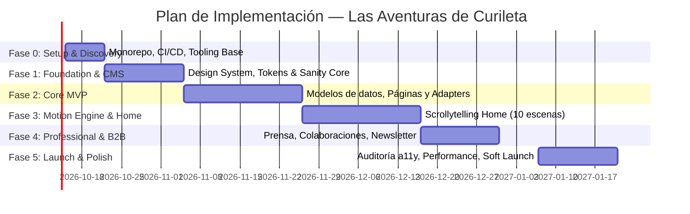

# Plan de Implementación — Web Oficial de «Las Aventuras de Curileta»

Documento de referencia técnica y operativa generado a partir del documento maestro de producto y arquitectura ([Proyecto_Web_Oficial_Las_Aventuras_de_Curileta.md](./Proyecto_Web_Oficial_Las_Aventuras_de_Curileta.md)).

---

## 1. Resumen Ejecutivo y Diagnóstico

El documento maestro establece una visión ambiciosa para la web oficial de **Las Aventuras de Curileta**: transformarla en el **epicentro digital y narrativo del universo de Curileta**, funcionando simultáneamente como experiencia de inmersión para niños y familias, y como portal profesional para editoriales, medios y licenciatarios.

### Pilares Fundamentales
1. **Curileta como Hilo Conductor:** El personaje no es un sticker decorativo; interactúa, guía y reacciona de forma reactiva y fluida.
2. **Scroll Continuo Narrativo («Una aventura continua»):** La Home funciona como una gran experiencia de producto interactiva al estilo de los lanzamientos de Apple, con 10 escenas interconectadas orgánicamente por un sendero luminoso.
3. **Contenido 100% Desacoplado:** Ningún dato editorial en el código. Sanity v3 como Headless CMS gestionando personajes, libros, vídeos, países, canciones y colaboraciones.
4. **Performance & Accesibilidad sin Concesiones:** Objetivos Core Web Vitals (LCP ≤ 2.5s, INP ≤ 200ms, CLS ≤ 0.1) y nivel WCAG 2.2 AA. `MotionSceneEngine` con 3 perfiles: *Full Motion*, *Adaptive Motion* y *Reduced Motion*.
5. **Multidioma desde el Día Cero:** Español (ES) e Inglés (EN) iniciales, arquitectura extensible a FR, PT, DE, IT sin reescritura.
6. **Privacidad Infantil Inquebrantable:** Cumplimiento de normativas de menores (COPPA / RGPD-K): cero publicidad comportamental, cero formularios dirigidos a menores, cero recopilación de PII infantil. Canales B2B claramente separados para adultos.
7. **Arquitectura por Adaptadores:** Aislamiento de proveedores externos (`CMSProvider`, `VideoProvider`, `CommerceProvider`, `AnalyticsProvider`, `MailProvider`).

---

## 2. Estructura de Repositorio (Monorepo)

```text
curileta-web/
├── apps/
│   ├── web/                    # Next.js 15+ (App Router, Server Components, TypeScript)
│   └── studio/                 # Sanity Studio v3 (Headless CMS)
├── packages/
│   ├── design-system/          # Design tokens, tipografía, componentes accesibles
│   ├── motion/                 # MotionSceneEngine, GSAP ScrollTrigger, perfiles
│   ├── cms/                    # Cliente GROQ, esquemas de Sanity, tipos TypeScript
│   ├── i18n/                   # Configuración next-intl, diccionarios de UI
│   ├── analytics/              # Telemetría de negocio anónima y sin PII
│   ├── seo/                    # Generadores de Schema.org JSON-LD, OG Images dinámicas
│   └── config/                 # Configuraciones compartidas (TS, ESLint, Tailwind)
├── tooling/                    # Scripts de build, optimización y auditoría
└── docs/                       # Documentación técnica y manuales de producto
```

---

## 3. Fases de Implementación y Cronograma Operativo



### Fase 0 — Discovery, Infraestructura y Monorepo (Semanas 1-2)
- [ ] Inicialización del repositorio Git y estructura monorepo con workspaces.
- [ ] Configuración compartida de TypeScript, ESLint (`jsx-a11y`) y Prettier.
- [ ] Creación de `apps/web` (Next.js 15 App Router) y `apps/studio` (Sanity Studio v3).
- [ ] Pipeline CI en GitHub Actions y configuración de entornos (Vercel Preview, Staging, Producción).

### Fase 1 — Foundation: Design System, Tokens y Motor i18n (Semanas 3-4)
- [ ] Definición de tokens de diseño semánticos (color, tipografía, radios, ritmo de animación).
- [ ] Componentes primitivos base en `packages/design-system` (`Button`, `Card`, `Modal`, `Drawer`, `FormField`).
- [ ] Storybook integrado para catálogo de componentes.
- [ ] Configuración de `next-intl` con enrutamiento localizado `/es` y `/en`.
- [ ] Creación del adaptador base `CMSProvider` y configuración de TypeScript CodeGen para Sanity.

### Fase 2 — Core MVP: Contenido Dinámico y Páginas Principales (Semanas 5-7)
- [ ] Modelado de esquemas en Sanity: `Character`, `Book`, `Adventure`, `Location`, `Video`, `Song`, `Collaboration`.
- [ ] Configuración de Sanity Live Preview / Visual Editing en tiempo real.
- [ ] Desarrollo de rutas y fichas editoriales en Next.js con Server Components:
  - `/personajes` y `/personajes/[slug]`
  - `/libros` y `/libros/[slug]` (con datos de compra y preview)
  - `/aventuras` y `/aventuras/[slug]`
  - `/videos` con `YouTubeProvider` (thumbnails estáticos, reproducción tras interacción sin bloqueo)
- [ ] Implementación de webhook seguro (`/api/revalidate`) para revalidación incremental selectiva por etiquetas (`revalidateTag`).

### Fase 3 — Motion: MotionSceneEngine y Scrollytelling de la Home (Semanas 8-10)
- [ ] Implementación del motor de escenas `MotionSceneEngine`:
  - Soporte de 3 perfiles de movimiento: *Full*, *Adaptive* y *Reduced Motion*.
  - Pausa de renders WebGL y animaciones fuera del viewport.
- [ ] Desarrollo de las 10 escenas narrativas de la Home:
  1. *Hero:* Bosque Encantado y Curileta interactivo.
  2. *El Mapa cobra vida:* Sendero luminoso y relieve progresivo.
  3. *Lugares a Aventuras:* Transición fotográfica/ilustrada sin cortes secos.
  4. *Los Amigos:* Carrusel espacial suave de personajes (Pompón, Quetzal, Lulú).
  5. *Los Libros:* Transformación 3D de ilustración a libro físico con paso de páginas.
  6. *YouTube:* Pantalla de vídeo optimizada bajo demanda.
  7. *Canciones:* Onda musical y fichas sonoras.
  8. *El Universo sigue creciendo:* Ramas y novedades.
  9. *Colaboraciones:* Transición hacia el tono profesional B2B.
  10. *Cierre:* Retorno circular al Bosque Encantado y CTA de continuidad.
- [ ] Soporte de `View Transition API` entre vistas.

### Fase 4 — Growth & Canales B2B: Prensa, Colaboraciones y Contacto (Semanas 11-12)
- [ ] Hub de Prensa y Medios (`/prensa`) con dossier, logos vectoriales y descargas de kits en ZIP.
- [ ] Portal de Colaboraciones y Licencias (`/colaboraciones`) para editoriales y marcas.
- [ ] Centro Unificado de Contacto (`/contacto`) con enrutamiento seguro de mensajes según categoría.
- [ ] Protección contra spam y abusos mediante Cloudflare Turnstile, honeypot y rate-limiting server-side.
- [ ] Módulo de Newsletter dirigido exclusivamente a adultos/tutores con double opt-in.

### Fase 5 — Optimización, Auditorías y Lanzamiento MVP (Semanas 13-14)
- [ ] Auditoría de accesibilidad WCAG 2.2 AA (navegación por teclado completa, axe-core, lectores de pantalla).
- [ ] Auditoría de Core Web Vitals (LCP ≤ 2.5s, INP ≤ 200ms, CLS ≤ 0.1).
- [ ] SEO Internacional: sitemaps por locale, hreflang cruzado y microdatos JSON-LD (`Book`, `VideoObject`, `Organization`).
- [ ] Observabilidad con Sentry y monitoreo de Web Vitals.
- [ ] Despliegue a producción y protocolo de Soft Launch.

---

## 4. Definición del Alcance del MVP

| Entra en MVP | Fuera de MVP (Fase Posterior con Feature Flags) |
| :--- | :--- |
| Home scrollytelling completa (10 escenas) con perfiles | Audio inmersivo ambiental opcional de fondo |
| Catálogos y fichas completas de Personajes y Libros | Lector interactivo de páginas de libros in-browser |
| Galería y fichas de Vídeos y Aventuras | Sincronización automática periódica con YouTube Data API |
| Ficha de Destinos y Países con vista narrativa | Globo terráqueo 3D interactivo en `/mundo` con geolocalización |
| Prensa, Colaboraciones B2B y Formulario de Contacto | Portal autoservicio de partners para descarga de manual de marca |
| Teaser de merchandising y catálogo editorial | Carrito de compra, checkout y Shopify Headless (`FEATURE_STORE: false`) |
| Idiomas: Español (`es-ES`) e Inglés (`en`) | Nuevos idiomas: Francés, Portugués, Alemán, Italiano |

---

## 5. Criterios de Aceptación y Definición de Terminado (DoD)

Para considerar cualquier entrega o historia como **Terminada (Done)**:
1. **Comportamiento & Diseño:** Cumple con la especificación y se ajusta a los tokens del design system.
2. **Responsive:** Probado y validado en móvil (360px+), tablet y pantallas de escritorio.
3. **Resiliencia:** Incluye estados de carga (*Skeleton*), error informativo y estado vacío (*Empty state*).
4. **Accesibilidad:** Pasa `axe-core` sin errores severos y es navegable al 100% por teclado con foco visible.
5. **i18n:** Cero textos quemados en código; disponible en ES y EN.
6. **SEO & Datos Estructurados:** Metadata adecuada y JSON-LD generado.
7. **Rendimiento:** Respeta el presupuesto de JavaScript crítico (≤ 180 KB gzip).
8. **Pruebas:** Tests unitarios de utilidades y componentes documentados en Storybook.
